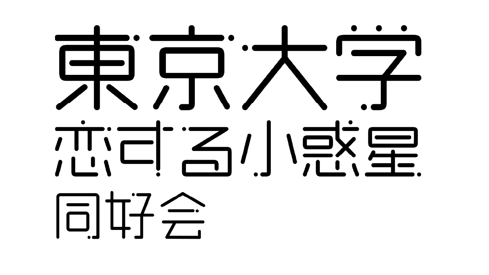
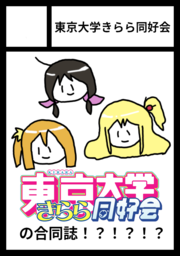
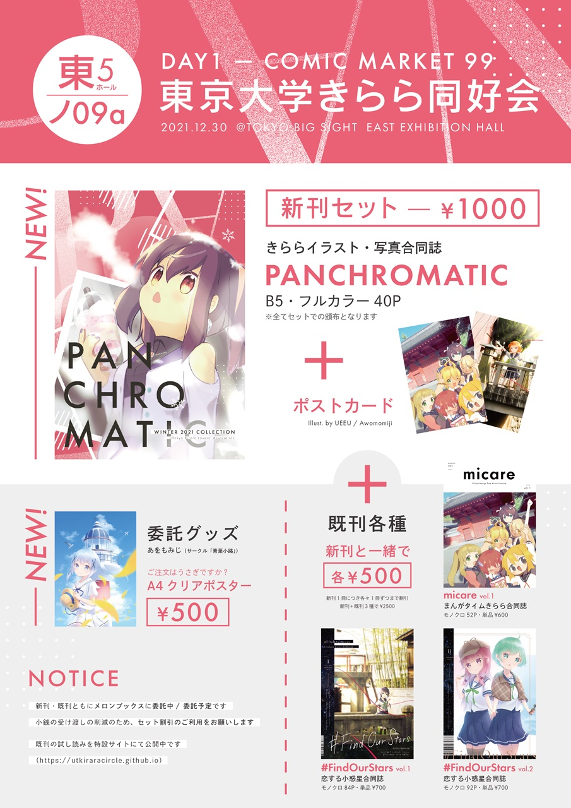
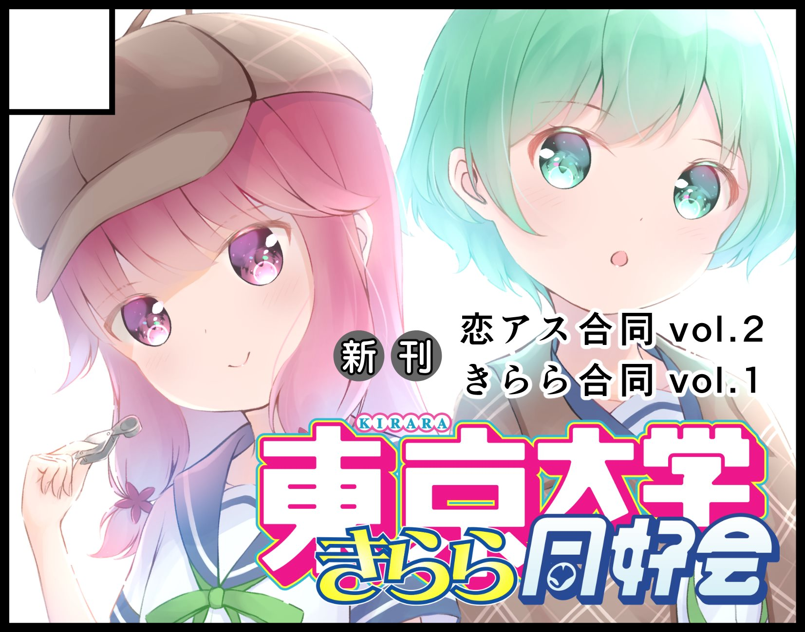
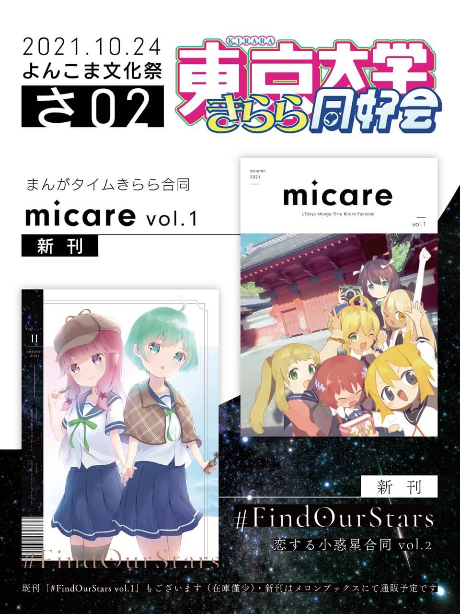
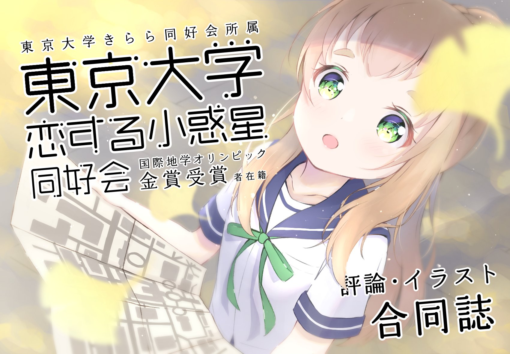
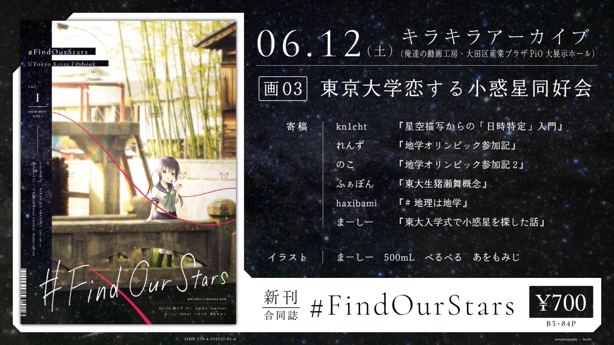

    

東京大学恋する小惑星同好会（東大恋アス同好会）は、東京大学学生による**『恋する小惑星』ファンコミュニティ**です。

当会は[東京大学きらら同好会](/)の支部であり、入会要件・方法等はきらら同好会の規定に準じます。

---

    
活動状況

### 2022年8月13日 「コミックマーケット100」にサークル参加します

2022年8月13日（土曜日）[コミックマーケット100](https://www.comiket.co.jp/info-a/C100/C100Notice2.html) に「**1日目東Y16a 東京大学きらら同好会**」としてサークル参加します。恋する小惑星同好会の既刊もございます。

### 2022年3月6日 恋アスオンリーイベント「キラキラアーカイブ」にサークル参加します

2022年3月6日（日曜日）動画工房作品オンリー「俺達の動画工房」内で開催される[恋する小惑星オンリーイベント「キラキラアーカイブ」](http://project-d.biz/douga/)に「**動07 東京大学きらら同好会**」で参加予定です。

恋する小惑星合同誌の既刊「#FindOurStars Vol.2」を頒布いたします。メロンブックス様からも引き続き購入いただけます。

    

### 2021年12月30日 「コミックマーケット99」にサークル参加します

    
    

2021年12月30日（木曜日）[コミックマーケット99](https://www.comiket.co.jp/info-a/C99A/C99ANotice2.html) に「**1日目東ノ09a 東京大学きらら同好会**」としてサークル参加します。

恋する小惑星同好会の新刊はございませんが、既刊「#FindOurStars Vol. 1, Vol. 2」の再版バージョンを頒布致します。初版の印刷以降に発見された誤字等を直したアップデート版です。

    
    

### 2021年10月24日 四コマ＆まんがタイム系オンリーイベント「よんこま文化祭2021」にサークル参加します

    
    

2021年10月24日（土曜日）に開催される[四コマ＆まんがタイム系オンリーイベント「よんこま文化祭2021」](https://www.yonkoma.info/p/index2021.html)に「**さ02 東京大学きらら同好会**」としてサークル参加します。

恋する小惑星同好会からは、2冊目の評論・イラスト合同誌「**#FindOurStars Vol. 2**」を頒布致します。
参加される方はぜひお立ち寄りください。

    
    

### 2021年6月12日 恋アスオンリーイベント「キラキラアーカイブ」にサークル参加します

    
    

2021年6月12日（土曜日）に動画工房作品オンリー「俺達の動画工房」内で開催される[恋する小惑星オンリーイベント「キラキラアーカイブ」](http://project-d.biz/douga/)に「**画03 東京大学恋する小惑星同好会**」としてサークル参加します。

『恋する小惑星』に関する評論・イラストをまとめた当会初の合同誌「**#FindOurStars Vol.1**」を頒布予定です。

    
    
    <!--  -->

---


